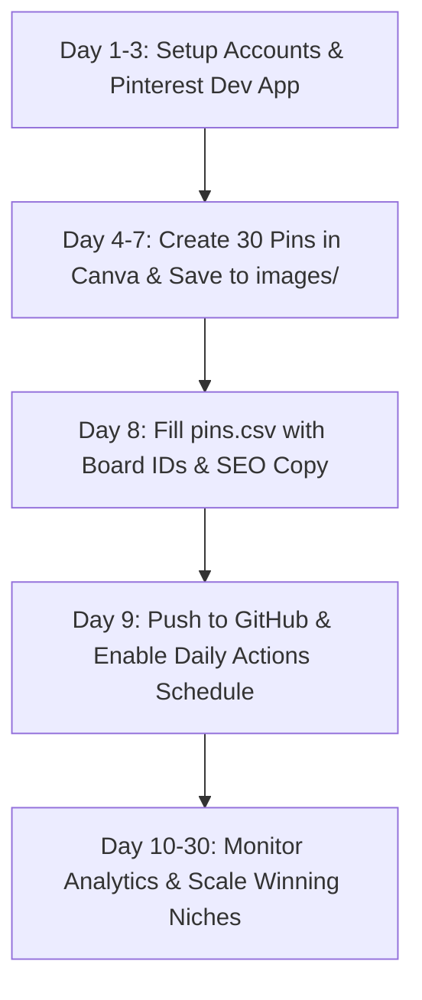

# The Ultimate Pinterest Automation Business Blueprint
### Turn Automated Pinterest Traffic into Daily Passive Income

---

## 1. How the Business Model Works

Unlike Instagram or TikTok, **Pinterest is not a social network — it is a visual search engine** (like Google Images combined with an online shopping catalog).

When people go to Pinterest, they are in **active buying mode**: they are searching for ideas, products, home decor, outfit inspiration, gift guides, and organization tools.

### The Conversion Flow:
```
1. Automated Bot posts 1-3 high-intent Pins every day on GitHub Actions.
2. User searches Pinterest (e.g., "small kitchen storage ideas").
3. User discovers your Pin, clicks the image, and is directed to your affiliate link or digital product.
4. User completes purchase.
5. You earn passive commissions (Amazon, digital downloads, affiliate networks).
```

Pins remain discoverable in search results for **months and even years**, meaning a Pin posted today can generate sales 8 months from now!

---

## 2. Step-by-Step: All Accounts You Need to Create

Follow this exact sequence to get everything set up properly:

### Step 1: Pinterest Business Account (Free)
1. Go to [pinterest.com/business/create/](https://www.pinterest.com/business/create/).
2. Register a new account (or convert an existing personal account to a Business Account for free).
3. **Optimize your profile**:
   - **Profile Name**: Include your niche keywords (e.g., `HomeVibe | Small Space Living & Decor`).
   - **Bio**: Tell what you curate and include a call to action (e.g., *"Curating the best budget space-saving organization finds for tiny homes and apartments. Shop our favorites below!"*).
   - **Profile Photo**: High-resolution logo or clean aesthetic lifestyle icon.
4. **Create 4–6 niche boards**:
   - Name them using popular search terms (e.g., `Small Kitchen Storage`, `Closet Organization Ideas`, `Budget Home Decor`).
   - Give each board a 2-sentence description containing keywords.

---

### Step 2: Pinterest Developer Portal & App
1. Log in to [developers.pinterest.com/apps](https://developers.pinterest.com/apps).
2. Click **Create App**.
3. Name your app (e.g., `MyPinPoster`).
4. In your App settings:
   - Copy your **Client ID** and **Client Secret**.
   - Under **Redirect URIs**, add: `https://localhost/callback`
5. Note: Your app starts in **Trial Access**. In Trial mode, you can post pins to test your setup.
6. Apply for **Standard Access** inside the developer dashboard. Pinterest asks for a short 30-second screen recording showing OAuth authorization. Standard Access makes your pins visible publicly to everyone.

---

### Step 3: Monetization Accounts (Choose 1 or 2 to start)

#### Option A: Amazon Associates (Best for Physical Goods)
- Sign up at [affiliate-program.amazon.com](https://affiliate-program.amazon.com).
- Commission: 1% to 10% on every product purchased (even items they buy outside your recommendation within 24 hours!).
- Find bestsellers in Home, Kitchen, Tech, Beauty, Organization.

#### Option B: Digital Products (100% Profit Margin)
- Sell printables, budget planners, Notion templates, or fitness guides.
- Platforms: [Gumroad.com](https://gumroad.com) or [Stan.store](https://stan.store) (Free to set up).
- You can sell a \$10 digital planner and keep 90%+ profit.

#### Option C: Affiliate Networks (High-Ticket Commissions)
- [Impact.com](https://impact.com) & [ShareASale.com](https://shareasale.com).
- Payouts: \$20 to \$100+ per software or brand subscription.

---

### Step 4: Free Canva Account (For Pin Graphics)
1. Sign up at [canva.com](https://canva.com) (Free plan is 100% sufficient).
2. Search for **"Pinterest Pin"** template (`1000 x 1500 px`).

---

## 3. The Anatomy of a Viral, High-Converting Pin

85%+ of Pinterest traffic is on mobile devices. People scroll quickly, so your Pin must stop the thumb in under 2 seconds:

| Pin Element | Best Practice | What to Avoid |
| :--- | :--- | :--- |
| **Canvas Size** | `1000 x 1500 px` (2:3 aspect ratio) | Square (1:1) or horizontal (16:9) |
| **Headline Overlay** | Bold, high-contrast font, 4-8 words max | Tiny script fonts nobody can read on phone |
| **Imagery** | Bright, aesthetic, problem-solving photo | Dark, blurry, low-resolution images |
| **Hook / Angle** | *"10 Genius Ways To Organize A Tiny Pantry"* | Boring generic title like *"Kitchen Jars"* |
| **Call To Action** | *"Save This Pin"* or *"Click to Shop Direct"* | No call to action |

---

## 4. Free, Zero-Cost Image Hosting

Your Pins require public image URLs. You do not need to pay for any hosting:

### Method 1: Host directly in your GitHub Repository (Recommended)
1. Put your images in the `images/` directory of this repo (e.g. `images/pin1.jpg`).
2. Push to GitHub.
3. Your URL is:
   ```
   https://raw.githubusercontent.com/<YOUR_USER>/<YOUR_REPO>/main/images/pin1.jpg
   ```
4. Paste that directly into the `image_url` column of `pins.csv`.

### Method 2: Free Cloud Image Hosts
- [Imgur.com](https://imgur.com) (Free direct image links).
- [Cloudinary.com](https://cloudinary.com) (Free tier gives 25GB storage).
- [Unsplash.com](https://unsplash.com) (For royalty-free lifestyle photography).

---

## 5. Pinterest SEO Strategy: How to Rank in Search

Pinterest's algorithm indexes your Pin based on text signals:

1. **Pin Title (Max 100 characters)**:
   - Put your main keyword at the beginning.
   - *Example*: `"Small Kitchen Organization Hacks: 10 Space Saving Ideas"`
2. **Pin Description (Max 500 characters)**:
   - Write 2-3 natural sentences containing secondary search terms.
   - Include clear disclosure: `#ad` or `#affiliate`.
   - *Example*: `"Struggling with a cluttered tiny kitchen? Discover these budget-friendly pantry organizer racks and hanging baskets that maximize vertical wall space. Save this pin for your next home organizing weekend! #affiliate"`
3. **Alt Text (Max 500 characters)**:
   - Describe what is in the picture for accessibility and visual search ranking.
   - *Example*: `"Minimalist kitchen counter with clear stackable acrylic food storage containers and spice jars."`

---

## 6. Anti-Spam Guidelines: Protecting Your Account

Pinterest has strong spam filters. Follow these rules to avoid shadowbans or account restrictions:

1. **Pacing**:
   - **Week 1–2**: Post 1 pin per day using the bot. Save 3–5 pins manually from other creators to establish natural activity.
   - **Week 3–4**: Increase to 2 pins per day.
   - **Month 2+**: 3–5 pins per day.
2. **Never post duplicate URLs repeatedly**:
   - Rotate your product links so you aren't linking to the same exact Amazon product 5 times in a row.
3. **Use Bridge Pages (Best Practice)**:
   - If promoting affiliate links, Pinterest algorithms prefer landing pages or bridge pages (e.g., a free [Blogger](https://blogger.com), [Substack](https://substack.com), or [Beacons.ai](https://beacons.ai) page).
   - This prevents affiliate link flags and allows you to collect email subscribers!

---

## 7. The 30-Day Profitability Action Plan



- **Days 1–3**: Create your Pinterest Business Account, boards, developer app, and get your `refresh_token`.
- **Days 4–7**: Spend 2 hours in Canva batch-creating 30 pins using templates. Save them as `pin1.jpg` through `pin30.jpg` in `images/`.
- **Day 8**: Fill out `pins.csv` with titles, descriptions, and affiliate links. Run `python validate_pins.py` to ensure zero errors.
- **Day 9**: Push to GitHub. The GitHub Actions bot will now publish your content daily automatically.
- **Days 10–30**: Check Pinterest Analytics weekly to see which pins get the highest outbound clicks. Double down on those winning topics!
